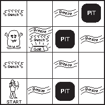

# Hunt the Wumpus

[Hunt the Wumpus](https://en.wikipedia.org/wiki/Hunt_the_Wumpus) is a hide-and-seek game which takes place in a cave containing rooms connected by passageways. Lurking somewhere in the cave is the Wumpus: a beast that eats whoever enters its room. An agent is looking for a treasure while avoiding the deadly Wumpus and some bottomless pits. To win the game the agent needs to locate the gold, grab it, and leave the cave alive avoiding the Wumpus and the pits in some of the rooms that will trap anyone (except for the Wumpus). The agent can kill the Wumpus by shooting on it but he/she has only one arrow. Originally the game was created by [Gregory Yob](https://www.atariarchives.org/bcc1/showpage.php?page=247), but we will be considering the version described by Russell and Norvig in their book [Artificial Intelligence: A Modern Approach](http://aima.cs.berkeley.edu/).

The game is played on a square grid where there are a number of randomly placed pits, an ingot of gold, and a wumpus (see the picture below). The wumpus doesn’t move. The agent, armed with a single arrow, is placed in the bottom left square (0,0) and the actions that can perform are: moving forward, turn left and right, shoot the arrow, grab the ingot, and climb out of the cave.

The agent perceive the environment by means of 5 boolean variables:

- Stench: wumpus in an adjacent square
- Breeze: pit in an adjacent square
- Glitter: gold in the same square
- Bump: hits the border while moving
- Scream: wumpus has been killed

Adjacency is just across orthogonal squares, not diagonal (see picture).

At the beginning we assume that the agent starts in the bottom left square (0,0) facing up (N).
To climb out of the cave the agent must go back to the starting square. The game ends when the agent climbs out, dies, or after a fixed number of actions.

At the end of the game the overall score is calculated as the sum of:

- +1000 for _leaving_ cave with gold (just grabbing it doesn't grant the prize)
- -1000 for falling in pit or being eaten by wumpus
- -1 for each action taken (different from shooting the arrow)
- -10 for using the arrow
